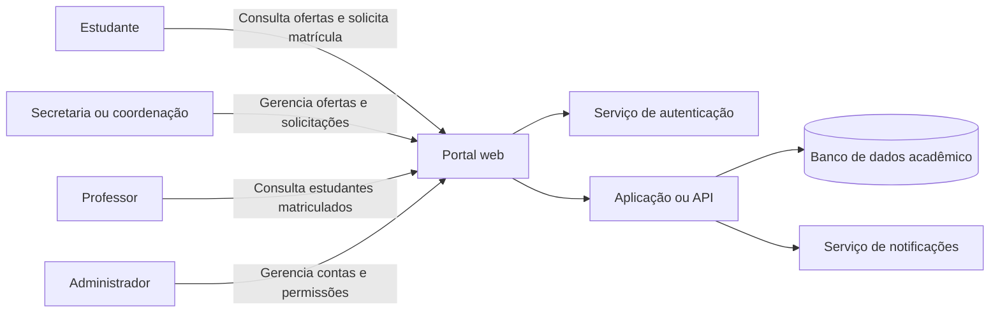

# Sistema de Matrículas Acadêmicas

## 1. Identificação do sistema

- **Nome do sistema:** Sistema de Matrículas Acadêmicas
- **Integrantes:** Nome do Integrante 1, Nome do Integrante 2 e Nome do Integrante 3
- **Repositório:** https://github.com/SEU-USUARIO/sistema-matriculas-seguro
- **Justificativa:** O sistema foi escolhido por possuir diferentes perfis de usuários, armazenar informações pessoais e acadêmicas e executar operações importantes, como solicitações e cancelamentos de matrícula.

> **Observação:** Este é um modelo didático inspirado em um sistema universitário de matrículas e não representa necessariamente a implementação real utilizada pela UNIPAMPA.

## 2. Descrição do sistema

O Sistema de Matrículas Acadêmicas permite que estudantes consultem os componentes curriculares ofertados, solicitem ou cancelem matrículas e acompanhem o resultado das solicitações. Servidores autorizados podem administrar ofertas, vagas e situações acadêmicas, enquanto professores consultam as turmas sob sua responsabilidade. O sistema armazena dados pessoais, informações acadêmicas, solicitações, resultados e registros das operações realizadas.

## 3. Usuários, ativos e pontos de interação

### 3.1 Usuários e perfis

| Usuário ou perfil | Principais ações |
| --- | --- |
| Estudante | Consultar ofertas, solicitar matrícula, cancelar solicitações e acompanhar resultados |
| Secretaria ou coordenação | Gerenciar ofertas, analisar solicitações e tratar situações acadêmicas |
| Professor | Consultar componentes curriculares e listas de estudantes matriculados |
| Administrador do sistema | Gerenciar contas, permissões, configurações e disponibilidade do sistema |

### 3.2 Ativos importantes

Os principais ativos identificados são:

- credenciais de acesso;
- dados pessoais dos estudantes;
- histórico e situação acadêmica;
- solicitações e cancelamentos de matrícula;
- resultados das solicitações;
- quantidade de vagas;
- listas de estudantes matriculados;
- permissões dos usuários;
- registros e logs das operações;
- disponibilidade do sistema durante o período de matrículas.

### 3.3 Pontos de interação e componentes

| Elemento | Função |
| --- | --- |
| Portal web | Interface utilizada pelos usuários |
| Serviço de autenticação | Valida a identidade e as credenciais dos usuários |
| Aplicação ou API | Processa as regras e operações do sistema |
| Banco de dados acadêmico | Armazena dados pessoais, acadêmicos e de matrículas |
| Serviço de notificações | Envia avisos e resultados aos usuários |

## 4. Visão geral da arquitetura ou fluxo

O estudante acessa o portal, autentica-se e envia solicitações para a aplicação. A aplicação consulta ou altera os dados acadêmicos no banco de dados e pode enviar notificações. Secretaria, coordenação, professores e administradores acessam funcionalidades diferentes de acordo com suas permissões.

## 5. Modelagem de ameaças com STRIDE

| ID | Categoria STRIDE | Componente ou ativo | Ameaça identificada | Possível impacto |
| --- | --- | --- | --- | --- |
| T01 | Spoofing | Conta do estudante | Um atacante utiliza credenciais roubadas para acessar a conta de um estudante | Solicitação ou cancelamento de matrículas em nome da vítima |
| T02 | Tampering | Solicitações e banco de dados | Um usuário altera indevidamente o componente, o resultado, o horário ou o número de vagas | Matrículas incorretas, favorecimento indevido e inconsistência acadêmica |
| T03 | Repudiation | Solicitações, cancelamentos e logs | Um usuário ou servidor nega ter realizado uma operação e o sistema não possui registros confiáveis | Impossibilidade de responsabilização e dificuldade para resolver contestações |
| T04 | Information Disclosure | Dados pessoais e acadêmicos | Uma pessoa acessa históricos, resultados ou listas de estudantes sem autorização | Violação de privacidade e exposição de informações acadêmicas |
| T05 | Denial of Service | Portal, autenticação ou API | Um atacante envia uma grande quantidade de requisições durante o período de matrículas | Indisponibilidade do sistema e perda de prazos pelos estudantes |
| T06 | Elevation of Privilege | Controle de acesso | Um estudante explora uma falha de autorização e obtém permissões de secretaria ou administrador | Alteração de ofertas, vagas, permissões e matrículas de outros estudantes |

### 5.1 Interpretação da análise

As ameaças demonstram que diferentes partes do sistema precisam ser protegidas. As contas estão relacionadas à identidade dos usuários; as solicitações e vagas dependem da integridade dos dados; os logs permitem responsabilizar os autores das operações; os dados acadêmicos exigem confidencialidade; o portal precisa permanecer disponível; e as funções administrativas devem ser acessíveis somente por usuários autorizados.

## 6. Casos de abuso

### CA01 — Cancelamento de matrícula por meio de conta roubada

**Ator:** atacante externo.

**Objetivo:** prejudicar um estudante cancelando suas solicitações ou matrículas.

**Condições necessárias:**

- o atacante obtém as credenciais da vítima;
- o sistema não exige uma verificação adicional para operações importantes;
- a conta da vítima pode ser acessada somente com o usuário e a senha obtidos.

**Fluxo de abuso:**

1. O atacante obtém o usuário e a senha do estudante.
2. O atacante acessa o sistema utilizando a identidade da vítima.
3. O atacante consulta as solicitações existentes.
4. O atacante cancela uma ou mais matrículas.
5. O estudante percebe o cancelamento posteriormente.

**Impacto esperado:** perda de vaga, atraso acadêmico, necessidade de contestação e prejuízo ao estudante.

**Categorias STRIDE relacionadas:** Spoofing, Tampering e Repudiation.

---

### CA02 — Estudante obtém permissões administrativas

**Ator:** estudante mal-intencionado.

**Objetivo:** alterar vagas ou matrículas utilizando funções reservadas à secretaria.

**Condições necessárias:**

- existe uma falha no controle de autorização;
- o sistema verifica apenas se o usuário está autenticado;
- as funções administrativas podem ser acessadas diretamente.

**Fluxo de abuso:**

1. O estudante autentica-se normalmente.
2. O estudante identifica uma página ou requisição utilizada pela secretaria.
3. O estudante acessa a função administrativa sem possuir a permissão necessária.
4. O estudante aumenta o número de vagas de um componente curricular.
5. O estudante altera sua própria situação de matrícula ou a de outro usuário.

**Impacto esperado:** manipulação do processo acadêmico, favorecimento indevido, inconsistência de dados e perda de confiança no sistema.

**Categorias STRIDE relacionadas:** Elevation of Privilege e Tampering.

---

### CA03 — Consulta indevida de dados acadêmicos

**Ator:** usuário autenticado sem autorização para consultar dados de terceiros.

**Objetivo:** obter informações pessoais ou acadêmicas de outros estudantes.

**Condições necessárias:**

- o sistema não verifica corretamente a qual usuário pertence o registro solicitado;
- identificadores de estudantes ou matrículas podem ser modificados;
- a aplicação retorna dados sem validar a autorização.

**Fluxo de abuso:**

1. O usuário acessa seus próprios dados acadêmicos.
2. O usuário modifica o identificador presente em uma página ou requisição.
3. O sistema retorna dados pertencentes a outro estudante.
4. O usuário repete a operação para consultar diferentes registros.
5. As informações são armazenadas ou divulgadas indevidamente.

**Impacto esperado:** violação de privacidade, exposição de informações pessoais e acadêmicas e possível uso indevido dos dados.

**Categorias STRIDE relacionadas:** Information Disclosure.

---

### CA04 — Indisponibilidade durante o período de matrículas

**Ator:** atacante externo ou grupo de atacantes.

**Objetivo:** impedir que os estudantes utilizem o sistema dentro do prazo.

**Condições necessárias:**

- o sistema não limita requisições excessivas;
- a infraestrutura não consegue absorver o volume de acessos;
- não existem mecanismos suficientes de proteção contra sobrecarga.

**Fluxo de abuso:**

1. O atacante identifica o período de maior utilização do sistema.
2. O atacante envia uma grande quantidade de requisições ao portal ou à API.
3. Os recursos do sistema ficam sobrecarregados.
4. Usuários legítimos recebem erros ou não conseguem acessar o sistema.
5. Parte dos estudantes não consegue solicitar matrícula dentro do prazo.

**Impacto esperado:** indisponibilidade, perda de prazos, aumento de solicitações administrativas e prejuízo aos estudantes.

**Categorias STRIDE relacionadas:** Denial of Service.

## 7. Considerações finais

As ameaças consideradas mais preocupantes são o acesso indevido às contas, a alteração de matrículas e vagas, a obtenção de permissões administrativas e a indisponibilidade durante os períodos de maior demanda.

Os ativos mais importantes são as credenciais, os dados pessoais e acadêmicos, as solicitações de matrícula, o número de vagas, as permissões e os registros das operações.

Os casos de abuso com maior impacto são a obtenção de privilégios administrativos e o cancelamento de matrículas utilizando a conta de outro estudante, pois podem causar prejuízos acadêmicos diretos e comprometer a confiança no sistema.

A principal dificuldade da análise foi diferenciar uma ameaça genérica de uma situação concreta relacionada ao sistema. A utilização do STRIDE ajudou a examinar o software sob diferentes perspectivas e a identificar ameaças que poderiam não ser percebidas em uma análise apenas funcional.
